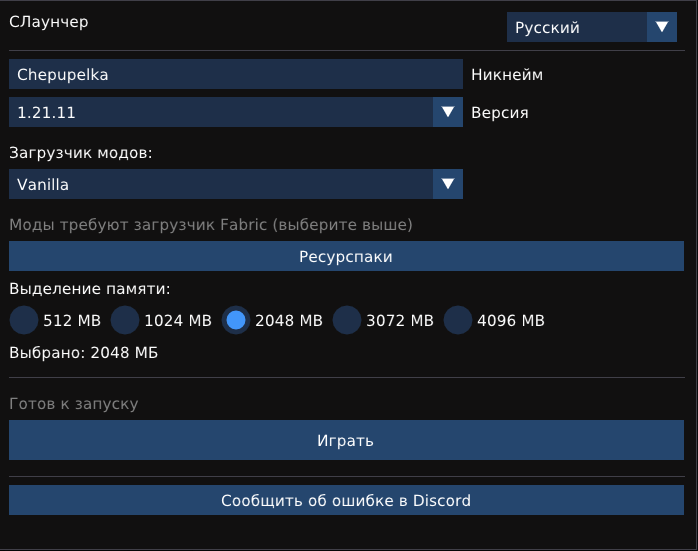
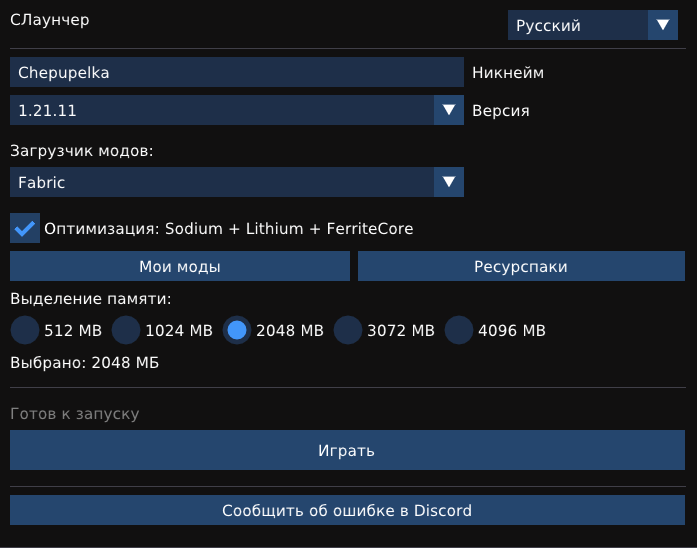

🇬🇧 [English](README.md) | 🇷🇺 Русский | 🇰🇿 [Қазақша](README_KZ.md)

# CLauncher

Лёгкий нативный лаунчер Minecraft для Linux и Windows, написанный на C++20 с интерфейсом на Dear ImGui и OpenGL. Спроектирован и написан одним разработчиком под старое железо: без рекламы, без телеметрии, без магазина, без обязательного аккаунта для офлайн-игры.

<p align="center">
  
</p>

Требуется OpenGL 3.0 или новее. Работает на Linux (Mint, Ubuntu, Debian) и Windows 10/11. Размер бинарного файла — около трёх мегабайт, лаунчер в режиме простоя потребляет примерно 30–50 МБ ОЗУ (память для самой Minecraft задаётся отдельно в интерфейсе). Основная машина для разработки и тестов — настольный ПК 2012 года. Это практический ориентир для старого железа, а не гарантия работы на абсолютно любой конфигурации.

## ЧТО УМЕЕТ

* **Установка Vanilla Minecraft прямо из лаунчера.** Клиент, библиотеки, ассеты и нативные библиотеки скачиваются автоматически с официальных серверов Mojang.
* **Поддержка Fabric.** Fabric ставится через официальный инсталлятор (лаунчер сам запускает его `.jar`), версия загрузчика берётся актуальной с серверов Fabric Meta.
* **Оптимизационные моды одной галочкой.** Sodium, Lithium и FerriteCore. Версии модов подбираются автоматически под выбранную версию Minecraft через API Modrinth.

<p align="center">
  
</p>

* **Свои моды.** Кнопка «Мои моды» открывает папку модов конкретной версии Fabric. Любой `.jar`-файл, положенный туда вручную, загрузится при запуске игры. У каждой версии Minecraft своя папка модов, поэтому моды разных версий не перемешиваются между собой (но могут быть несовместимы друг с другом, как и в любом Fabric).
* **Ресурспаки.** Кнопка «Ресурспаки» открывает общую папку ресурспаков. Положите туда zip-архив, а затем включите его в меню наборов ресурсов в самой игре.
* **Автоматическое управление Java.** Сначала лаунчер ищет совместимую системную Java (через `java -version`). На Linux он при необходимости может доустановить нужную JRE пакетным менеджером дистрибутива (apt, dnf, pacman, zypper или apk), а в крайнем случае всегда скачивает портативную JRE (8, 17 или 21 под выбранную версию Minecraft) с серверов Adoptium. На Windows используется только портативная JRE.
* **Параллельная загрузка.** Ассеты Minecraft — это несколько тысяч мелких файлов. Лаунчер качает их пулом из шестнадцати потоков с переиспользованием соединений, что сокращает первую установку с часа до нескольких минут.
* **Проверка целостности.** Скачиваемые файлы игры (клиент, библиотеки, нативные библиотеки и ассеты), а также оптимизационные моды с Modrinth проверяются по SHA1 там, где Mojang или Modrinth предоставляют контрольную сумму. Повреждённые и недокачанные файлы обнаруживаются и автоматически перекачиваются при следующем запуске.
* **Отзывчивый интерфейс.** Вся установка идёт в фоновом потоке, окно не зависает, прогресс виден в реальном времени.
* **Два языка интерфейса.** Английский и русский, переключение на лету, выбор сохраняется.
* **Документация на трёх языках.** README доступны на английском, русском и казахском.
* **Безопасный запуск.** Игра запускается через `execv` на Linux и `CreateProcessW` на Windows, без привлечения командной оболочки. Длинный classpath передаётся через argfile, поэтому ни длина, ни спецсимволы в нике не могут сломать запуск.

## ПОДДЕРЖИВАЕМЫЕ ВЕРСИИ

* **Vanilla и Fabric:** все релизы ветки 1.x из манифеста Mojang, вплоть до линейки 1.21.x (Fabric — начиная с 1.14.x).
* **Линейка 26.x** и всё новее сознательно не поддерживаются: они требуют Java 25 и нового инструментария модов, рассчитаны на заметно более новое железо, чем то, под которое заточен лаунчер, и пока свежие и нестабильные. Для 26.x используйте официальный лаунчер. Поддержка может появиться, когда линейка и её экосистема модов устаканятся.

**Требования к системе:** Linux Mint 21+, Ubuntu 22.04+, Debian 12+, либо Windows 10 и 11. OpenGL 3.0 и выше. Готовый AppImage требует glibc 2.35 или новее. На более старых системах потребуется сборка из исходников.

## СКАЧАТЬ

Готовые сборки лежат на [странице Releases](https://github.com/chepupel123/CLauncher/releases):

* `CLauncher-Linux.zip` — Linux x86_64. Внутри — самодостаточный `CLauncher-x86_64.AppImage`: всё необходимое уже включено, дополнительные пакеты не требуются (требуется glibc 2.35+; распакуйте, сделайте исполняемым, запустите).
* `CLauncher-Windows-x64.zip` — Windows 10/11 x64 (бета, ещё не проверена на реальной Windows-системе). Внутри — `CLauncher-beta.exe` вместе с необходимыми DLL (GLFW/curl). Распакуйте архив и запустите `.exe`.

Если хотите собрать из исходников — инструкция ниже.

## БЫСТРЫЙ СТАРТ НА LINUX

Сначала установите зависимости. В терминале выполните:

```bash
sudo apt-get update
sudo apt-get install -y build-essential cmake git pkg-config unzip \
  libglfw3-dev libgl1-mesa-dev libcurl4-openssl-dev \
  nlohmann-json3-dev libx11-dev libxrandr-dev libxinerama-dev \
  libxcursor-dev fonts-dejavu-core
```

Затем скачайте проект: кнопка «Code» → «Download ZIP» на странице репозитория (или `git clone`) и перейдите в папку проекта:

```bash
git clone https://github.com/chepupel123/CLauncher.git
cd CLauncher
```

Библиотека Dear ImGui уже включена в проект (папка `extern/imgui`), дополнительно её скачивать не нужно.

Соберите:

```bash
rm -rf build
mkdir build
cd build
cmake ..
make -j$(nproc)
```

Запустите:

```bash
./CLauncher
```

## БЫСТРЫЙ СТАРТ НА WINDOWS

Понадобится MSYS2. Скачайте установщик с сайта msys2.org и установите в `C:\msys64`. Откройте терминал MSYS2 MINGW64 и выполните:

```bash
pacman -Syu
pacman -S --needed mingw-w64-x86_64-gcc mingw-w64-x86_64-cmake \
  mingw-w64-x86_64-ninja mingw-w64-x86_64-curl \
  mingw-w64-x86_64-glfw mingw-w64-x86_64-nlohmann-json make
```

Затем в терминале перейдите в папку проекта и соберите:

```bash
mkdir build
cd build
cmake .. -G Ninja -DCMAKE_BUILD_TYPE=Release
ninja
```

Появится файл `CLauncher.exe`. Он динамически слинкован с `glfw3.dll` и `libcurl-4.dll` из MSYS2: запускайте его из оболочки MINGW64 либо положите эти DLL (и их зависимости) рядом с `.exe` — в релизном zip они уже лежат вместе с хранилищем TLS-сертификатов `cacert.pem`.

При первом запуске SmartScreen или антивирус может показать предупреждение, так как `.exe` не подписан: нажмите «Подробнее» → «Выполнить в любом случае». Архивы Java распаковываются встроенным `tar.exe` (Windows 10 1803+), PowerShell используется только как запасной вариант на старых системах.

## КАК ЭТО РАБОТАЕТ ВНУТРИ

При нажатии кнопки Play лаунчер выполняет следующую цепочку:

1. `MinecraftInstaller` сверяется с манифестом Mojang и докачивает недостающее: клиент игры, библиотеки, несколько тысяч ассетов и нативные компоненты. При параллельной загрузке каждый файл сначала пишется во временное имя `.part` и переименовывается только после успешной проверки SHA1; файлы без опубликованной контрольной суммы в случае ошибки просто повторно запрашиваются.
2. **Fabric (опционально).** Если выбран Fabric, запускается официальный инсталлятор Fabric, версия загрузчика берётся актуальная с Fabric Meta, а затем с Modrinth скачиваются Sodium, Lithium и FerriteCore, подобранные под вашу версию игры.
3. **JavaManager.** Если подходящей Java нет, сначала проверяется системная, затем на Linux лаунчер попробует установить нужную пакетным менеджером дистрибутива, и лишь в последнюю очередь скачает портативную JRE с серверов Adoptium и распакует её в локальную папку.
4. **JavaLauncher.** Игра запускается через `execv` на Linux или `CreateProcessW` на Windows. Никакой командной оболочки между лаунчером и игрой нет, длинный classpath передаётся через argfile. После успешного старта игры лаунчер закрывается сам через полторы секунды, а идентификатор процесса игры сохраняется в файл `last_game.pid`.

**Ключевые архитектурные решения:**

* Используется стандартная папка `.minecraft`, совместимая с официальным лаунчером, поэтому миры, ресурспаки и прочие игровые данные общие.
* У каждой версии Fabric своя папка модов, поэтому моды разных версий не перемешиваются.
* При каждом запуске выполняется проверка целостности установленного, и докачивается только недостающее или повреждённое.
* Индекс ассетов для Fabric-профилей берётся из родительской ванильной версии через наследование (`inheritsFrom`).

## ИСПОЛЬЗОВАНИЕ

1. Введите ник. Только латиница, цифры и знак подчёркивания, другие символы фильтруются автоматически.
2. Выберите версию из списка. Список берётся из официального манифеста Mojang и кешируется, поэтому работает и без интернета.
3. Выберите загрузчик: Vanilla или Fabric. Для Fabric доступна галочка оптимизационных модов.
4. Выберите объём памяти. Рекомендуется 2048 мегабайт.
5. Нажмите Play. Первая установка небыстрая; на последующих запусках установленное только проверяется и докачивается недостающее, поэтому они заметно быстрее.

Кнопка «Мои моды» открывает папку модов текущей версии Fabric. Кнопка «Ресурспаки» открывает папку ресурспаков. В правом верхнем углу — переключатель языка.

## ГДЕ ЧТО ЛЕЖИТ

**На Linux:**

* Игра: `.minecraft` в домашнем каталоге
* Миры: `.minecraft/saves`
* Моды: `.minecraft/versions/имя-версии/mods`
* Ресурспаки: `.minecraft/resourcepacks`
* Скачанная Java: `.minecraft-launcher/runtime`
* Настройки лаунчера: `.minecraft-launcher/launcher_settings.json`

**На Windows:**

* Игра: `.minecraft` в вашем пользовательском каталоге
* Моды и миры: аналогично Linux
* Скачанная Java и настройки лаунчера: папка `minecraft-launcher` внутри AppData Roaming

## ИДЕНТИФИКАТОР ИГРОКА БЕЗ АККАУНТА

Лаунчер генерирует детерминированный офлайн-UUID из ника по стандартной схеме Minecraft `OfflinePlayer:` (именованный MD5-UUID версии 3) — тот же идентификатор, который сервер в офлайн-режиме вычисляет из ника. Он стабилен между запусками, поэтому прогресс в мирах сохраняется корректно.

## ИЗВЕСТНЫЕ ОГРАНИЧЕНИЯ

* Линейка 26.x не поддерживается полностью (включая ваниль): она требует Java 25, рассчитана на более новое железо, чем целевое для лаунчера, и пока нестабильна. Выбирайте 1.21.x или старше.
* Windows-исполняемый файл не подписан, поэтому SmartScreen или антивирус могут показать предупреждение при первом запуске («Подробнее» → «Выполнить в любом случае»). Java распаковывается встроенным `tar.exe` (PowerShell — только запасной вариант).
* Первая установка небыстрая: несколько тысяч файлов ассетов. Последующие запуски заметно быстрее: всё кешируется и проверяется по SHA1, заново качается только недостающее.
* Кириллица в нике не принимается намеренно: ник используется на серверах и в файлах миров, где безопасен только ограниченный набор символов.

## ЕСЛИ ЧТО-ТО НЕ РАБОТАЕТ

* **Ошибка `GLFW init failed`.** Не установлен GLFW или запуск идёт не в графической сессии. Установите `libglfw3-dev`.
* **Вопросительные знаки вместо текста.** Не найден шрифт с поддержкой кириллицы. Установите `fonts-dejavu-core`.
* **Скачивание Java не удалось.** Проверьте интернет, либо установите Java вручную: если мажорная версия совпадает, лаунчер использует системную.
* **Пропали звуки или пустой список языков.** Нажмите Play на этой версии ещё раз: лаунчер проверит ассеты и докачает недостающее.
* **Игра вылетает сразу после старта.** Чаще всего мод не от вашей версии Minecraft. Удалите его из папки модов.
* **Загрузка остановилась на середине.** Нажмите Play снова: уже скачанные файлы остаются на месте и проверяются по SHA1, заново качаются только недостающие и недокачанные.
